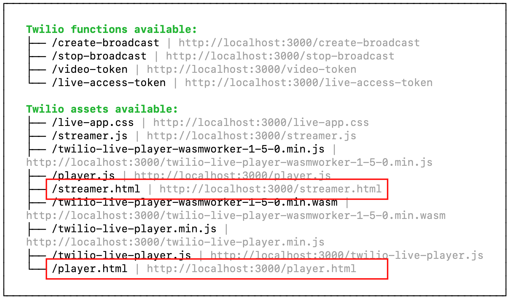
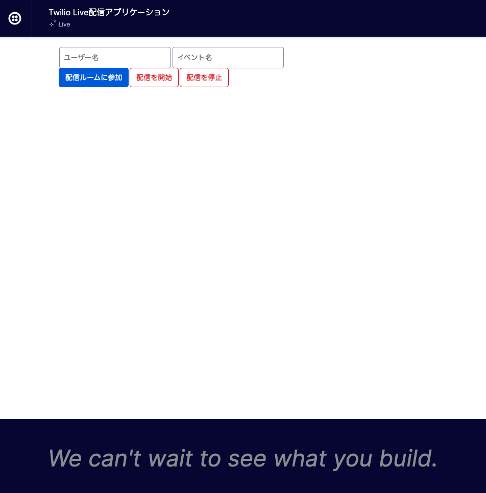
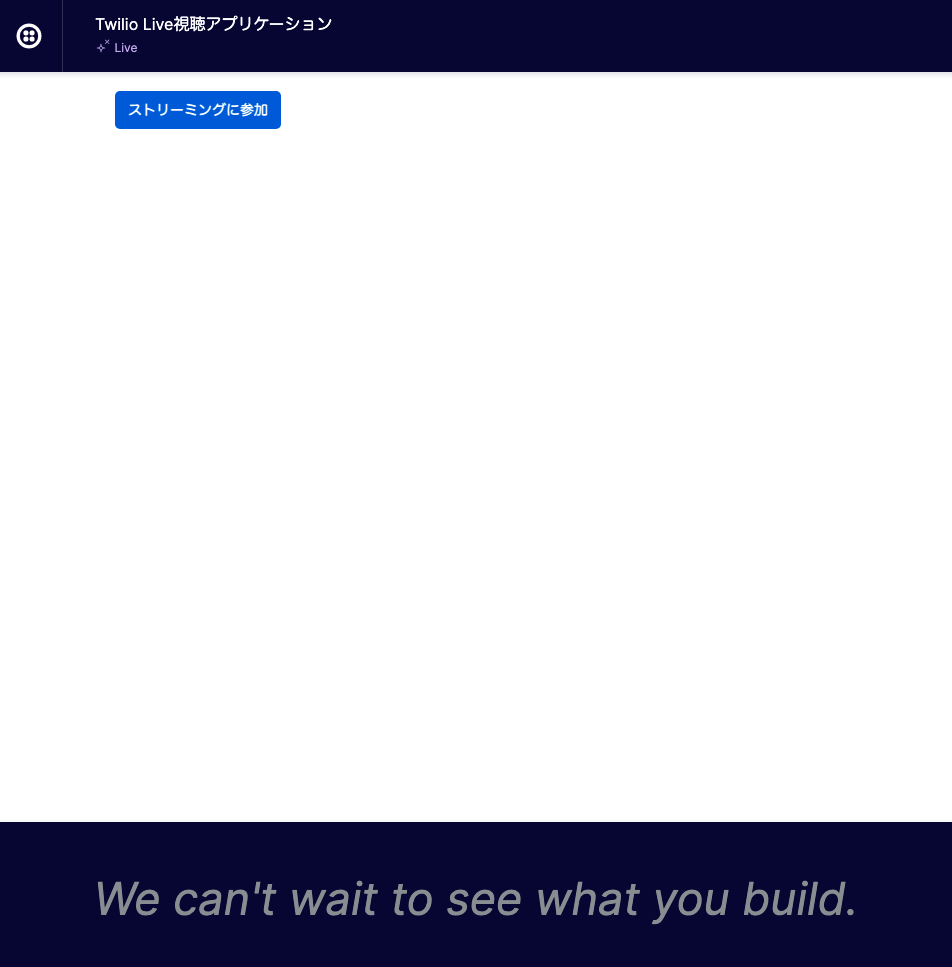

# 手順1: サンプルアプリケーションをローカル環境にクローン

この手順ではTwilio CLIおよびServerless Toolkitを用いて作成されたTwilio Serverlessプロジェクトをローカル環境にクローンします。

## 1-1. サンプルアプリケーションをクローン

[サンプルアプリケーション](https://github.com/neri78/live-sample-jp)をクローンするため、下記のコマンドを実行します。

```bash
git clone https://github.com/neri78/live-sample-jp.git
```

Gitをインストールしていない場合は代わりにZipをダウンロードし、展開します。

クローンまたは展開した`live-sample-jp`フォルダに移動し、依存関係パッケージをインストールします。

```bash
cd live-sample-jp
npm install
```

## 1-2. テスト実行

このプロジェクトには配信用、視聴用それぞれのアプリケーションが一部実装されています。実際に画面を確認してみましょう。

下記コマンドを実行しアプリケーションを起動します。

```bash
npm start
```

正しく起動できると下記のようにコンソールの出力画面にパスが表示されます。



[`http://localhost:3000/streamer.html`](http://localhost:3000/streamer.html)をブラウザーで開くと配信用画面が表示されます。



配信用画面のビデオチャット機能はすでに実装されています。ただし、Twilio認証情報が登録されていないため、`配信ルームに参加`ボタンをクリックしても正しく動作しません。

`配信を開始`ボタン、`配信を停止`ボタンは機能が実装されていないため現時点では動作しません。

一方、[`http://localhost:3000/player.html`](http://localhost:3000/player.html)をブラウザーで開くと視聴用画面が表示されます。



こちらも`ストリーミングに参加`ボタンは現時点で動作しません。

それぞれの機能を実装するためにはTwilioのAPIを利用します。次の手順ではアプリケーションからTwilio APIを呼び出すために必要な認証情報を確認、作成します。

## 次の手順

- [Twilio認証情報の確認とAPIキー/シークレットの作成](02-Twilio-Credentials.md)