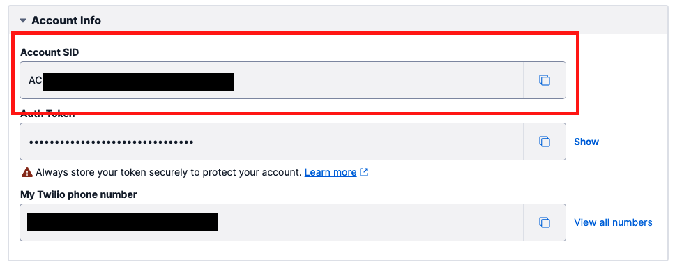
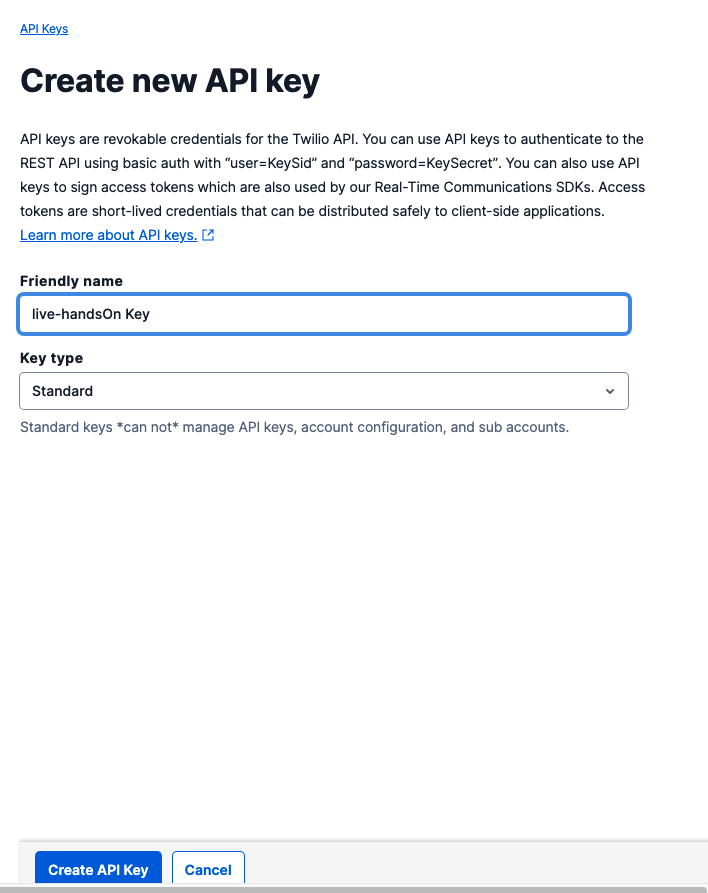
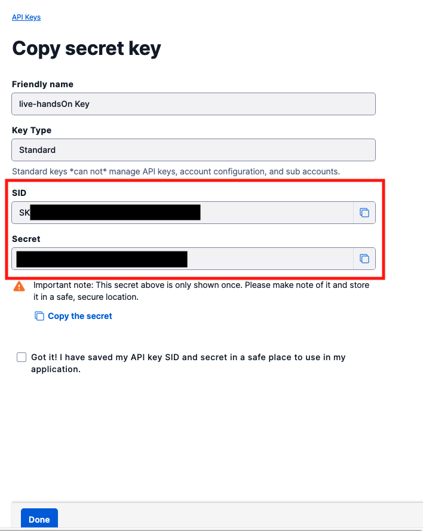
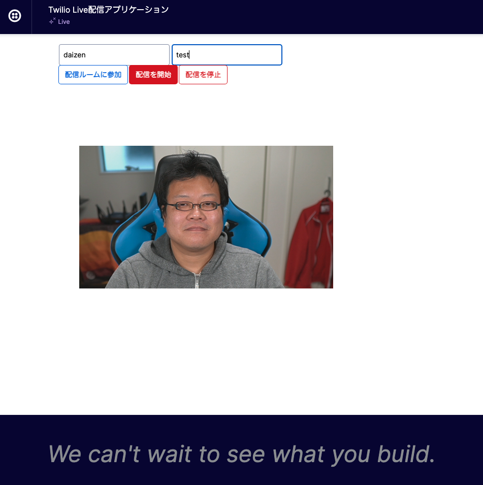

# 手順2: Twilio認証情報の確認とAPIキー/シークレットの作成

この手順ではTwilio APIを利用するための認証情報を確認、作成します。

## 2-1. 環境変数ファイルをリネーム

クローンしたプロジェクトには`.env.sample`ファイルが用意されており、下記の環境変数が定義されています。

```
ACCOUNT_SID=
API_KEY=
API_SECRET=
SYNC_SERVICE_SID=
```

これらの値を設定し、アプリケーションで読み込むため、ファイルをコピー、またはリネームし`.env`ファイルを作成します。

## 2-2. TwilioコンソールでAccount SIDを確認し、環境変数に指定

Twilioが提供するサービスの多くはアカウント情報（`Account SID`, `Auth Token`）を利用し認証します。これらの情報はコンソールから確認できます。

[Twilioホームページ](https://www.twilio.com/ja/)をブラウザーで開き、[LOG IN](https://jp.twilio.com/login) をクリックするか、[コンソール](https://jp.twilio.com/console)に直接移動します。

この画面に表示されている`ACCOUNT SID`を先ほど作成した`.env`ファイルの`ACCOUNT_SID`の値として設定します。



## 2-3. APIキーの生成

続いてAPIキーを作成します。[APIキー作成画面](https://www.twilio.com/console/project/api-keys/create)を表示します。

`FRIENDLY NAME`に作成する任意の名前を入力します。また、`KEY TYPE`が`Standard`であることを確認します。



`Create API Key`ボタンをクリックするとキーが作成され、`SID`並びに`SECRET`が表示されます。両方の値を`.env`ファイルの`API_KEY`、`API_SECRET`の値として指定します。コピーする値を間違えると正しく動作しません。



なお、`SECRET`はこの画面のみ、一度しか表示されません。忘れてしまった場合はキーを削除する必要があるためご注意ください。

## 2-4. ビデオルームが動作していることを確認

`ACCOUNT_SID`、`API_KEY`、`API_SECRET`の値を設定したことを確認したのち、再度アプリケーションを起動し、[`http://localhost:3000/streamer.html`](http://localhost:3000/streamer.html)をブラウザーで開きます。

名前とイベント名を入力し`配信ルームに参加`ボタンをクリックするとビデオチャットが開始されることを確認してください。

初めてアプリを起動する場合は、ブラウザからカメラやマイクの使用許可を促すポップアップが表示される場合があります。使用を許可するとビデオチャットが開始されます。



このビデオチャットは少ない料金ながらも分単位で課金されます。動作を確認できたらタブを閉じて終了してください。

## 次の手順

- [コンソールでTwilio Syncサービスを作成](03-Create-Sync-Service.md)