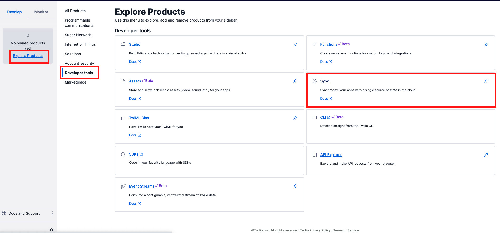
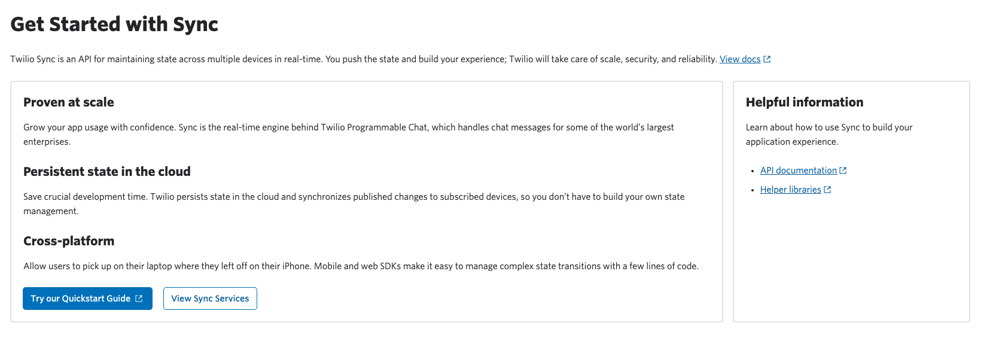
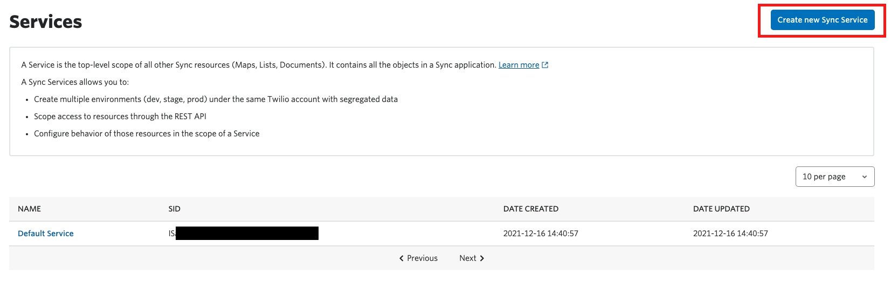
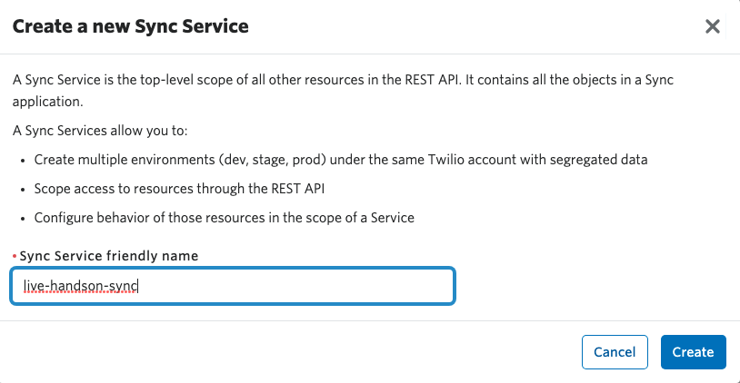
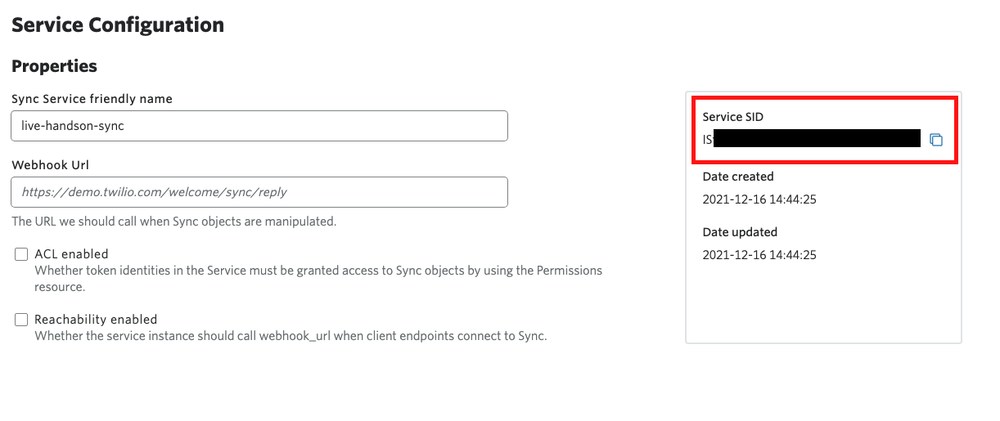

# 手順3: コンソールでTwilio Syncサービスを作成

下記の構成図のように配信を視聴するためには`PlayerStreamer SID`に対応する再生権限をクライアント側にトークンで渡す必要があります。

ハンズオン後半でこの部分を実装しますが、今回は[Twilio Sync](https://www.twilio.com/docs/sync)という複数の端末で状態を同期できるサービスを利用し、配信情報を一時保管します。

## 3-1. Syncサービスの作成

[コンソール](https://www.twilio.com/console)から[Explore Products]リンクをクリックし、[Sync]を開きます。

Overview画面の`View Sync Services`ボタンをクリックするか、画面左のナビゲーションから`Services`をクリックします。

`Create new Sync Service`ボタンをクリックし、ハンズオン用に新たにサービスインスタンスを作成します。

任意の名前をサービスに設定し、`Create`ボタンをクリックするとサービスが作成されます。

作成が完了すると設定画面が表示されます。この画面に表示されている`Service SID`の値を`.env`ファイルの`SYNC_SERVICE_SID`に設定します。

これでTwilio APIを利用するために必要なすべての情報が揃いました。

`.env`ファイルの値がすべて設定されることを確認し、次のセクションへ進んでください。

---------------
Twilio Syncについては別途ハンズオンを用意しています。ご興味があればぜひこちらもお試しください。

[Twilio Syncを使った状態同期](https://neri78.github.io/Twilio-HandsOn-Sync-JP/)

---------------

## 次のセクション

- [配信側アプリ - ストリーミング開始機能を実装](../02-Streamer-Create-Broadcast/00-Overview.md)