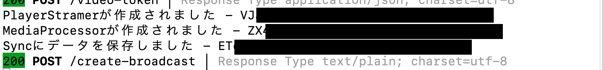

# 手順2: ストリーミングの情報を保存

この手順では後ほどトークンを作成する際に必要となるストリーミングの情報をTwilio Syncを使って保存します。

## 2-1. 保存するデータを作成

今回はTwilio Syncの[Document Resource](https://www.twilio.com/docs/sync/api/document-resource)を使用してデータを保存します。そのためDocumentの名前と保存するデータをそれぞれ作成します。手順1で実装したコードの直後に次のコードブロックを追加します。

```js
  // Documentの名前
  const documentName = 'streaming_info';
  
  // 保存するデータ
  const jsonData = JSON.stringify({
    roomSid : roomSid,
    playerStreamerSid : playerStreamer.sid,
    mediaProcessorSid : mediaProcessor.sid
  });
```

## 2-2. Syncからデータを取得

次に既に`streaming_info`という名前のDocument Resourceが存在するかを確認し、存在していればデータを更新、存在していなければ新規に作成を行います。

```js

  // ドキュメントを検索
  let syncDocuments = await client.sync.services(SYNC_SERVICE_SID)
    .documents
    .list({
      documentName: documentName
    });
    
  // 存在していればそちらを更新
  if (syncDocuments.length) {
    syncDocument = syncDocuments[0];
    await syncDocument.update({ data: jsonData });
  }
  else {
    // 存在していなければ作成
    syncDocument = await client.sync.services(SYNC_SERVICE_SID)
      .documents.create({
        uniqueName: documentName,
        data: jsonData
      });
  }
  console.log(`Syncにデータを保存しました - ${syncDocument.sid}`);
```

先ほどと同様にアプリケーションを再起動し、[http://localhost:3000/streamer.html](http://localhost:3000/streamer.html)をブラウザーで開くいたのち、配信ルームに参加、そして`配信を開始`ボタンをクリックするとコンソールにそれぞれのインスタンスを作成したログが表示されます。



テスト後、忘れずに下記のコマンドを実行し、インスタンスを終了します。

```bash
node delete-media-processors.js
```

これで配信開始機能が実装されました。

ここまでのコードは下記の通りです。途中でうまく動かなくなってしまった場合はこちらを参考に実装してください。

```js
exports.handler = async function (context, event, callback) {

  // 環境変数からTwilio資格情報を取得
  const { ACCOUNT_SID, API_KEY, API_SECRET } = context;

  // 環境変数からSync Service SIDを取得
  const { SYNC_SERVICE_SID } = context;


  // ここから実装を開始
  // Video Room SIDをリクエストから取得
  const roomSid = event.roomSid;

  // Twilio Nodeヘルパーライブラリを初期化
  const client = require('twilio')(
    API_KEY, 
    API_SECRET, 
    {accountSid: ACCOUNT_SID});

  // PlayerStreamerを作成
  const playerStreamer = await client.media.playerStreamer.create();
  console.log(`PlayerStreamerが作成されました - ${playerStreamer.sid}`);

  // MediaProcessorを作成
  const mediaProcessor = await client.media.mediaProcessor.create({
    extension: 'video-composer-v1',
    extensionContext: JSON.stringify({
      room: { name: roomSid },
      outputs: [playerStreamer.sid]
    })
  });
  console.log(`MediaProcessorが作成されました - ${mediaProcessor.sid}`);

  // Documentの名前
  const documentName = 'streaming_info';

  // 保存するデータ
  const jsonData = JSON.stringify({
    roomSid : roomSid,
    playerStreamerSid : playerStreamer.sid,
    mediaProcessorSid : mediaProcessor.sid
  });
  

  // ドキュメントを検索
  let syncDocuments = await client.sync.services(SYNC_SERVICE_SID)
    .documents
    .list({
      documentName: documentName
    });

  // 存在していればそちらを更新
  if (syncDocuments.length) {
    syncDocument = syncDocuments[0];
    await syncDocument.update({ data: jsonData });
  }
  else {
    // 存在していなければ作成
    syncDocument = await client.sync.services(SYNC_SERVICE_SID)
      .documents.create({
        uniqueName: documentName,
        data: jsonData
      });
  }
  console.log(`Syncにデータを保存しました - ${syncDocument.sid}`);

  callback(null, '');
};
```

## 次のセクション

- [配信側アプリ - ストリーミング停止機能を実装](../03-Streamer-Stop-Broadcast/00-Overview.md)