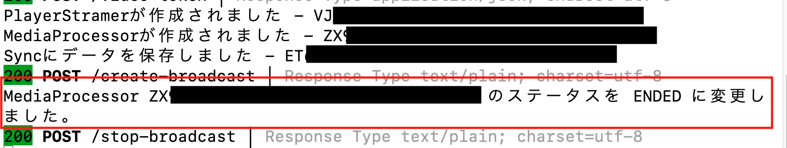

# 手順1: Twilio Syncから配信情報を取得しインスタンスを停止

この手順ではサーバー側のロジックを実装し、配信開始時に保存していたデータを取得します。

## 1-1. stop-broadcast.jsを確認

`配信を開始`ボタンがクリックされると、*functions/stop-broadcast.js*が呼び出されます。

現時点では以下のように環境変数の取得やレスポンス、そして先ほど実装したようなTwilio Nodeヘルパーライブラリの初期化コードが実装されています。

```js
exports.handler = async function (context, event, callback) {


  // Twilio資格情報を取得
  const { ACCOUNT_SID, API_KEY, API_SECRET } = context;

  // 環境変数からSync Service SIDを取得
  const { SYNC_SERVICE_SID } = context;

  // Twilio Nodeヘルパーライブラリを初期化
  const client = require('twilio')(
    API_KEY, 
    API_SECRET, 
    {accountSid: ACCOUNT_SID});


  // ここから実装を開始


  callback(null, '');
};
```

## 1-2. Twilio Syncから配信情報を取得

先ほどとは逆向きの実装として、Twilio Syncに保存されている`streaming_info`という名前のDocument Resourceを取得します。

```js
  // Sync Document名
  const documentName = 'streaming_info';

  // Sync Documentを取得
  let syncDocument  = await client.sync.services(SYNC_SERVICE_SID)
    .documents(documentName)
    .fetch();
  
```

## 1-3. 取得した情報をもとにMediaProcessorを停止し、該当するSync Documentを削除

Document Resourceが取得できた場合は、`MediaProcessor SID`を取得し、インスタンスを停止します。MediaProcessorが停止すると接続されているPlayerStreamerも自動的に停止します。

インスタンスの停止を確認し、Sync Documentを削除します。

```js
  // ドキュメントが取得できた場合
  if (syncDocument) {
    // MediaProcessor Sidを取得
    const { mediaProcessorSid } = syncDocument.data;
    const result = await client.media.mediaProcessor(mediaProcessorSid)
      .update({
        status: 'ended'
      });
    console.log(`MediaProcessor ${result.sid} のステータスを ${result.status} に変更しました。`);

    if (result.status === 'ENDED') { 
      // Sync Documentを削除
      await client.sync.services(SYNC_SERVICE_SID)
      .documents(documentName)
      .remove();
    }
  }
```

先ほどと同様にアプリケーションを再起動し、[http://localhost:3000/streamer.html](http://localhost:3000/streamer.html)をブラウザーで開くいたのち、配信ルームに参加します。`配信を開始`ボタンをクリックし、2-3秒待った後、`配信を停止`ボタンをクリックします。

下記のように配信の開始、および終了を示すログが出力されていることを確認します。



テスト後、下記のコマンドを実行し、削除すべきインスタンスが残っていないか確認します。もし、削除メッセージが表示された場合はロジックを見直してください。

```bash
node delete-media-processors.js
```

これで配信停止処理の実装が完了しました。ここまでのコードは次のようになっています。

```js
exports.handler = async function (context, event, callback) {


  // Twilio資格情報を取得
  const { ACCOUNT_SID, API_KEY, API_SECRET } = context;

  // 環境変数からSync Service SIDを取得
  const { SYNC_SERVICE_SID } = context;

  // Twilio Nodeヘルパーライブラリを初期化
  const client = require('twilio')(
    API_KEY, 
    API_SECRET, 
    {accountSid: ACCOUNT_SID});


  // ここから実装を開始
  // Sync Document名
  const documentName = 'streaming_info';

  // Sync Documentを取得
  let syncDocument  = await client.sync.services(SYNC_SERVICE_SID)
    .documents(documentName)
    .fetch();

    // ドキュメントが取得できた場合
    if (syncDocument) {
      // MediaProcessor Sidを取得
      const { mediaProcessorSid } = syncDocument.data;
      const result = await client.media.mediaProcessor(mediaProcessorSid)
        .update({
          status: 'ended'
        });
      console.log(`MediaProcessor ${result.sid} のステータスを ${result.status} に変更しました。`);
  
      if (result.status === 'ENDED') { 
        // Sync Documentを削除
        await client.sync.services(SYNC_SERVICE_SID)
        .documents(documentName)
        .remove();
      }
    }

  callback(null, '');
};
```


## 次のセクション

- [視聴画面 - ストリーミング視聴機能を実装](../04-Player-Join-Streaming/00-Overview.md)